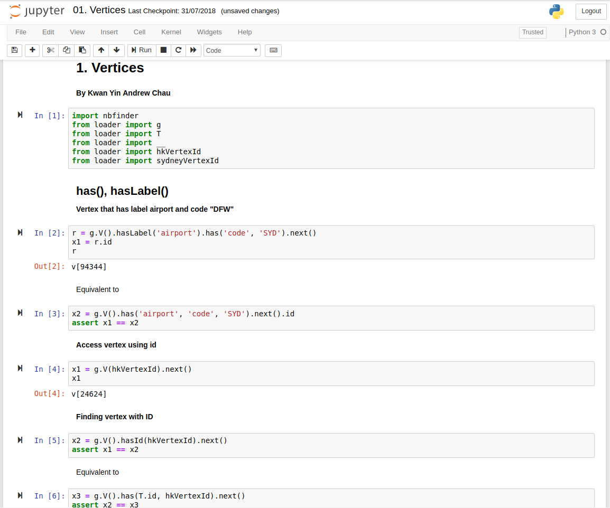

### Work in progress: more chapters to come in the future

# Learning Gremlin with Jupyter Notebooks
As a believer of learning through examples, I have decided to put my own examples of Gremlin queries inside Jupyter Notebooks for people to actually try out. The course is roughly based on this book (http://kelvinlawrence.net/book/Gremlin-Graph-Guide.pdf) by krlawrence but adapted into Python for execution inside a Jupyter Notebook.

## Download Notebooks and Sample Data
Clone or download this repository which contains all the Jupyter Notebooks and a copy of the GraphML sample data. The sample data contains an abundance of air route and airport data provided by krlawrence (https://github.com/krlawrence/graph/blob/master/sample-data).

## Setup JanusGraph
### Install
Although these notebooks were written using JanusGraph, it is possible to use other graph databases.
You can install JanusGraph via https://github.com/JanusGraph/janusgraph/releases.

### Start JanusGraph
`./janusgraph.sh start`

### Load Sample Data
We want to load the sample data into a remote JanusGraph database.

`./gremlin.sh`

`gremlin> :remote connect tinkerpop.server conf/remote.yaml`

`gremlin> :> graph.io(graphml()).readGraph('[path to repository]/data/air-routes.graphml')`

You can double check the data loaded successfully by checking the count.

`gremlin> :> g.V().count()`

This should result in:

`==>3619`

## Setup Jupyter
### Install
Install Jupyter if you haven't already (http://jupyter.org/install).
You will also need to install the following Python packages:
- nbfinder
- gremlinpython
Please note that the version of gremlinpython you install must match the version of TinkerPop. For example, JanusGraph 0.3.1 uses TinkerPop 3.3.3. Hence you need to install the corresponding version.

`pip3 install gremlinpython==3.3.3`

### Open Notebooks
Run Juypter inside the repository folder you cloned or downloaded.

`jupyter notebook`

## Run the Notebooks
Now simply run the Juypter notebooks inside the "Gremlin Notebooks" folder.

## Imports
As seen in all of the notebooks, the necessary packages are imported using the loader. Here is a list of what's available.

`from loader import Barrier`
- `Barrier.normSack`

`from loader import Cardinality`
- `Cardinality.single`
- `Cardinality.list_`
- `Cardinality.set_`

`from loader import Column`
- `Column.keys`
- `Column.values`

`from loader import Direction`
- `Direction.OUT`
- `Direction.IN`
- `Direction.BOTH`

`from loader import Operator`
- `Operator.sum`
- `Operator.minus`
- `Operator.mult`
- `Operator.div`
- `Operator.min`
- `Operator.max`
- `Operator.assign`
- `Operator.and_`
- `Operator.or_`
- `Operator.addAll`
- `Operator.sumLong`

`from loader import Order`
- `Order.incr`
- `Order.decr`
- `Order.keyIncr`
- `Order.valueIncr`
- `Order.keyDecr`
- `Order.valueDecr`
- `Order.shuffle`

`from loader import P`
- `P.between()`
- `P.eq()`
- `P.gt()`
- `P.gte()`
- `P.inside()`
- `P.lt()`
- `P.lte()`
- `P.neq()`
- `P.not_()`
- `P.outside()`
- `P.test()`
- `P.within()`
- `P.without()`

`from loader import Pick`
- `Pick.any`
- `Pick.none`

`from loader import Pop`
- `Pop.first`
- `Pop.last`
- `Pop.all_`

`from loader import Scope`
- `Scope.global_`
- `Scope.local`

`from loader import T`
- `T.label`
- `T.id`
- `T.key`
- `T.value`

